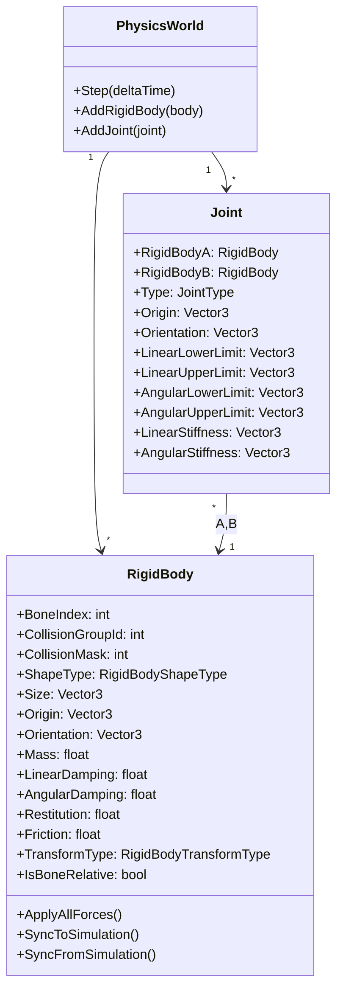
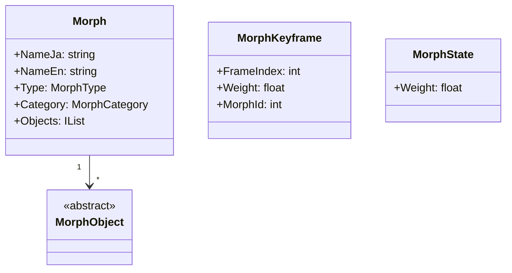

# Nanoem Porting Guide

本ドキュメントは nanoem の各サブシステムを C# へ移植する際の対応先を記す。

## サブシステム一覧

| サブシステム | 対応する C# 先 |
|--------------|----------------|
| ext | AppCore/Util |
| fuzz | なし（テストのみ） |
| khash.h | System.Collections.Generic |
| nanoem.c | AppCore/Data |
| nanoem.h | AppCore/Data |
| nanoem_p.h | AppCore/Data（内部） |
| proto | AppCore/Data/Proto |
| test | 未移植 |
| version.c.in | AppCore/App |

## ボーン表示ポリシー

nanoem の物理ボーン（剛体にバインドされたボーン）の表示可否は次の条件で判定される。

- `ShowAllBones` が無効な場合、剛体にバインドされたボーンは描画しない。
- `ShowAllBones` が有効かつボーンが編集マスクされていない場合のみ描画する。
- 上記の条件で描画された物理ボーンであっても選択対象にはならない。

C# 実装時もこのポリシーに従い、物理ボーンは既定で非表示とし、`ShowAllBones` が有効なときのみ編集可能なボーンを表示する。


## モデル読み込みと初期化フロー

1. **モデル読み込み**  
   `Model::load` は `model::Importer` を用いて入力データを解析し、OBJ/DXM/MQO などファイル種別ごとに処理を切り替える【F:Documents/nanoem-main/emapp/src/model/Importer.cc†L71-L94】。読み込みが成功するとインポート記述子からモデル名とコメントを設定する【F:Documents/nanoem-main/emapp/src/Model.cc†L975-L987】。
2. **物理・IK セットアップ**  
   ボーンを列挙してユーザーデータをバインドし、ボーンに紐づく `Constraint` を検出して登録する【F:Documents/nanoem-main/emapp/src/Model.cc†L1248-L1284】。`Model::solveAllConstraints` は全ての `Constraint` を反復して IK を解決する【F:Documents/nanoem-main/emapp/src/Model.cc†L2256-L2267】。その後、剛体・ジョイント・ソフトボディを取得して物理エンジンにバインドし、言語情報やフィードバックを初期化する【F:Documents/nanoem-main/emapp/src/Model.cc†L1328-L1356】。
3. **モーフ構築**  
   すべてのモーフを走査し、頂点モーフの場合は関連ボーンを収集して物理挙動に影響するボーン集合を生成する。カテゴリごとにアクティブモーフを設定し、名称とモーフ本体の対応表を構築する【F:Documents/nanoem-main/emapp/src/Model.cc†L1294-L1321】。

## 物理データ構造

nanoem の剛体およびジョイントは以下のフィールドを持つ。

### RigidBody

- `BoneIndex`: 剛体に関連付けられたボーンのインデックス
- `CollisionGroupId`: 衝突グループ ID
- `CollisionMask`: 衝突マスク
- `ShapeType`: 形状種別
- `Size`: 形状サイズ (Vector3)
- `Origin`: 位置 (Vector3)
- `Orientation`: 回転 (Vector3)
- `Mass`: 質量
- `LinearDamping`: 移動減衰
- `AngularDamping`: 回転減衰
- `Restitution`: 反発係数
- `Friction`: 摩擦係数
- `TransformType`: ボーンとシミュレーションの同期方法
- `IsBoneRelative`: ボーン相対座標かどうか

### Joint

- `RigidBodyAIndex`: 接続元剛体のインデックス
- `RigidBodyBIndex`: 接続先剛体のインデックス
- `Type`: ジョイント種別
- `Origin`: 位置 (Vector3)
- `Orientation`: 回転 (Vector3)
- `LinearLowerLimit`: 移動下限 (Vector3)
- `LinearUpperLimit`: 移動上限 (Vector3)
- `AngularLowerLimit`: 回転下限 (Vector3)
- `AngularUpperLimit`: 回転上限 (Vector3)
- `LinearStiffness`: 移動スティフネス (Vector3)
- `AngularStiffness`: 回転スティフネス (Vector3)

## AppCore/Physics クラス図



## 物理更新処理の疑似コード

```pseudo
function UpdatePhysicsWorld(world, deltaTime):
    # ボーンの状態を物理剛体へ反映
    for body in world.rigidBodies:
        body.ApplyAllForces()
        if body.TransformType == FromBoneToSimulation or body.IsKinematic:
            body.SyncToSimulation()
    # 物理シミュレーションを一歩進める
    engine.StepSimulation(deltaTime)
    # シミュレーション結果をボーンへ反映
    for body in world.rigidBodies:
        if body.TransformType != FromBoneToSimulation and not body.IsKinematic:
            body.SyncFromSimulation(followBone=false)
```


## IK 解決ルーチン

nanoem の IK は `Constraint` オブジェクトを用い、ターゲットボーンとエフェクタボーンの間にある各ジョイントを反復的に解いて姿勢を更新する【F:emapp/src/Model.cc†L3685-L3742】。各ジョイントは `Constraint::Joint` 構造体で回転・位置・軸・角度などの反復結果を保持する【F:emapp/include/emapp/model/Constraint.h†L18-L42】。

一方で `AppCore/IK` ではボーン選択と位置更新のみが実装され、IK ソルバーや制約管理は存在しない【F:AppCore/IK/IkManager.cs†L11-L14】。

### 必要なデータ構造
- `Constraint` クラス: ターゲットボーン、エフェクタボーン、ジョイント一覧、角度制限を保持
- `Constraint.Joint` 構造体: 各ジョイントの姿勢、軸、角度、方向ベクトルを記録
- 反復結果を格納するマップ (`JointIterationResult` / `EffectorIterationResult`)

### 必要なメソッド
- `SolveConstraint`: 各 `Constraint` を反復的に解いてボーン姿勢を更新
- `SolveAxisAngle`: ボーンの現在の変換とターゲット／エフェクタ位置から回転軸と角度を算出
- `HasUnitXConstraint`: ジョイントに X 軸固定制限があるか判定
- ジョイントごとの反復結果取得メソッド (`JointIterationResult`, `EffectorIterationResult`)
- `IkManager` への制約読み込み・解決処理の追加

これらを導入することで nanoem の IK 解決ロジックを C# 側に移植できる。

## モーフ処理

### 必要なデータ構造

- `nanoem_model_morph_group_t`: 他モーフの重みを合成するグループ要素【F:Documents/nanoem-main/nanoem/nanoem_p.h†L439-L443】
- `nanoem_model_morph_vertex_t`: 頂点インデックスと相対インデックスを持つ頂点モーフ【F:Documents/nanoem-main/nanoem/nanoem_p.h†L445-L450】
- `nanoem_model_morph_bone_t`: ボーンインデックスと平行移動・回転を保持するボーンモーフ【F:Documents/nanoem-main/nanoem/nanoem_p.h†L452-L456】
- `nanoem_model_morph_uv_t`: 親モーフ参照と UV 座標変位を持つ UV モーフ【F:Documents/nanoem-main/nanoem/nanoem_p.h†L459-L463】
- `nanoem_model_morph_material_t`: 材質インデックスと各種色・不透明度を含む材質モーフ【F:Documents/nanoem-main/nanoem/nanoem_p.h†L466-L481】
- `nanoem_model_morph_flip_t`: 他モーフの重みを反転させるフリップモーフ【F:Documents/nanoem-main/nanoem/nanoem_p.h†L483-L487】
- `nanoem_model_morph_impulse_t`: 剛体インデックスと速度・トルクを適用するインパルスモーフ【F:Documents/nanoem-main/nanoem/nanoem_p.h†L489-L495】
- `nanoem_model_morph_t`: 名称、種別、カテゴリと各モーフ要素配列を保持するモーフ本体【F:Documents/nanoem-main/nanoem/nanoem_p.h†L497-L513】
- `nanoem_motion_morph_keyframe_t`: モーフ ID と重みを持つモーション用キーフレーム【F:Documents/nanoem-main/nanoem/nanoem_p.h†L790-L794】
- `nanoem_document_model_morph_keyframe_t`: ドキュメント上のモーフキーフレーム【F:Documents/nanoem-main/nanoem/ext/document_p.h†L108-L112】
- `nanoem_document_model_morph_state_t`: 各モーフの現在重みを表す状態オブジェクト【F:Documents/nanoem-main/nanoem/ext/document_p.h†L130-L133】
- `nanoem_model_morph_category_t` / `nanoem_model_morph_type_t`: モーフのカテゴリと種別を定義する列挙体【F:Documents/nanoem-main/nanoem/nanoem.h†L1706-L1735】

### C# クラス設計と UI 連携方針



- `Morph` は nanoem のモーフ本体に対応し、名称・種別・カテゴリと各モーフ要素を保持する。
- `MorphObject` はボーン/頂点/UV など各種モーフ要素の基底クラスとし、必要に応じて派生型 (`BoneMorph` や `MaterialMorph` など) を定義する。
- `MorphKeyframe` はモーション上のモーフ重みを管理し、タイムライン編集に用いる。
- `MorphState` は現在の重みを保持し、UI とモデル更新の橋渡しを行う。

UI ではカテゴリごとにモーフ一覧を表示し、`MorphState.Weight` をスライダーにバインドする。ユーザがスライダーを操作すると `MorphState` を更新し、モデル側のモーフ適用処理を呼び出す。タイムラインでは `MorphKeyframe` を挿入・編集してアニメーションを構築し、`Morph` と `MorphState` 間の同期を取ることでリアルタイムにプレビューを反映する。
