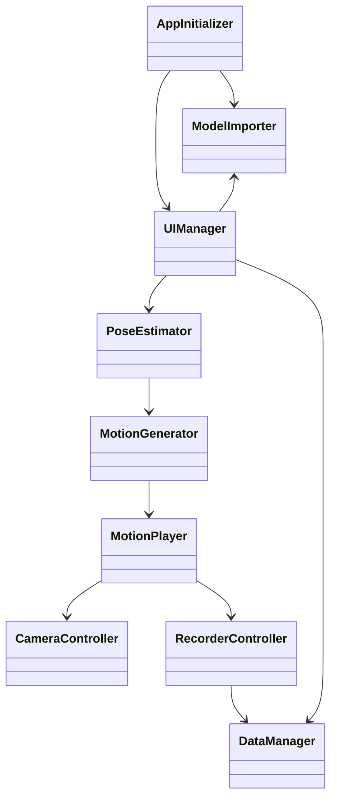
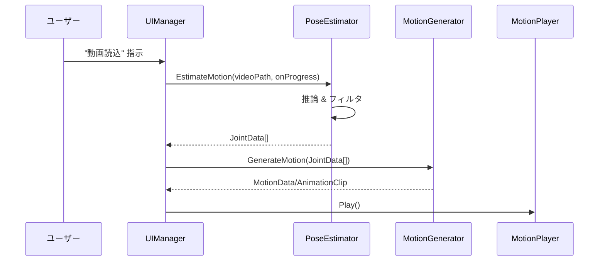

# スマホで完結する MMD 風ダンス生成アプリ開発文書

## 1. 文書管理

| 項目 | 内容 |
| --- | --- |
| 文書名 | MMD-スマホダンサー 開発文書 |
| バージョン | 1.0 |
| 作成日 | 2025-06-20 |
| 作成者 | 開発チーム |
| 承認者 | プロダクトオーナー |
| 改定履歴 | 初版 |

## 2. 目次
1. 文書管理
2. 目次
3. 用語定義
4. 概要・目的
5. 範囲（スコープ）
6. 利害関係者
7. 要件定義
8. システムアーキテクチャ
9. コンポーネント設計
10. データ設計
11. フォルダ構成
12. クラス構成
13. ユースケース
14. シーケンス図
15. UI設計
16. テスト計画
17. リスク管理
18. マイルストーン・ロードマップ
19. LLM／Codex 連携方針
20. 付録：外部ライブラリ・参考資料

## 3. 用語定義

| 略語 | 説明 |
| --- | --- |
| MMD | MikuMikuDance 形式のモーションデータ（VMD/BVH） |
| FBX/VRM/PMX | 本アプリが対応する3Dモデル形式 |
| Pose AI | OpenPose／MediaPipe／MoveNet 等の姿勢推定エンジン |
| ARCam | スマホ姿勢と同期する仮想カメラコンポーネント |
| JSON CFG | UI・シーン構築を宣言的に定義するJSON設定ファイル |
| LLM | CodexやChatGPTなどの大規模言語モデル |

## 4. 概要・目的

**目的**

ユーザー自身が用意した3Dキャラクターモデルに対し、スマホで撮影・指定したダンス動画からAI姿勢推定を行ってモーションを生成し、AR連動カメラ操作と録画機能を通じて「スマホだけでMMD風ダンス動画」を作成・共有できるアプリを開発する。

**ゴール**
- iOS／Android両対応
- FBX/VRM/PMXモデルのインポート
- 動画→骨格推定→3Dモーション生成
- 端末動作同期カメラ
- 動画録画・保存・共有
- 開発はGUI操作なし、C#＋JSON／設定ファイルで完結
- 開発者はCodex/ChatGPTでコード生成・設計支援を受ける

## 5. 範囲（スコープ）

### イン・スコープ
- モバイル端末上での非リアルタイム姿勢推定処理
- Humanoidリグへのモーション転写
- ジャイロ／ARKit／ARCoreによるカメラ同期
- 動画録画（MP4）とSNS共有UI
- C#＋JSONベースでのUI・シーン構築

### アウト・オブ・スコープ
- クラウド上でのリアルタイム推定
- 複数人同時モーション推定
- PC/VRプラットフォーム対応
- エンドユーザー向けLLMチャット機能

## 6. 利害関係者

| 役割 | 名前／組織 | 関心事 |
| --- | --- | --- |
| プロダクトオーナー | ユーザー代表 | UX／市場価値 |
| 開発リーダー | 開発チーム | 技術選定／進捗管理 |
| 開発者 | 開発チーム各位 | コード品質／LLM連携 |
| QA担当 | 品質保証チーム | テスト計画／品質基準 |
| 運用・サポート | 運営チーム | ログ・エラーレポート／ユーザー問い合わせ |

## 7. 要件定義

### 7.1 機能要件

| ID | 要件 | 優先度 |
| --- | --- | --- |
| F-1 | FBX/VRM/PMXモデルのインポート・Humanoid Avatar生成 | ★★★ |
| F-2 | 動画ファイルまたはURL指定によるダンス動画入力 | ★★★ |
| F-3 | MediaPipe Pose（Sentis/ONNX）による骨格推定 | ★★★ |
| F-4 | 推定結果をBVH/VMDまたは内部データ構造に変換 | ★★☆ |
| F-5 | Humanoidリグへのモーション適用（AnimationClip生成 or スクリプト適用） | ★★★ |
| F-6 | ジャイロ／ARKit／ARCoreによるカメラ同期（6DoF） | ★★★ |
| F-7 | 録画開始・停止・MP4出力（720p/1080p選択） | ★★★ |
| F-8 | UIはC#＋JSON CFGで動的生成（GUI編集不要） | ★★★ |
| F-9 | 録画動画のSNS共有ボタン（TikTok/YouTube/Twitter） | ★★☆ |
| F-10 | ユーザー設定保存（録画解像度・スムージングON/OFF等） | ★★☆ |

### 7.2 非機能要件

| 区分 | 要件 |
| --- | --- |
| パフォーマンス | 中級スマホで動画→モーション生成を数十秒以内に完了 |
| 起動時間 | 3秒以内 |
| バッテリー | 10分録画で20%未満消費 |
| メモリ | 500MB以下 |
| ストレージ | 1分動画 ≒ 100MB |
| セキュリティ | 全処理ローカル完結。外部送信はユーザー許可必須 |
| 保守性 | モジュール化・疎結合設計。JSON CFGで機能追加容易 |
| 拡張性 | 複数モーション・AR背景・エフェクト等将来機能を想定 |

## 8. システムアーキテクチャ

```mermaid
flowchart TD
    subgraph モバイルアプリ (Unity+C#)
      UIManager
      ModelImporter
      PoseEstimator
      MotionGenerator
      MotionPlayer
      CameraController
      RecorderController
      DataManager
    end

    subgraph ローカル処理
      PoseEstimator -->|ONNX推論| Sentis
    end

    UIManager --> ModelImporter
    UIManager --> PoseEstimator
    PoseEstimator --> MotionGenerator
    MotionGenerator --> MotionPlayer
    MotionPlayer --> CameraController
    MotionPlayer --> RecorderController
    RecorderController -->|MP4| DataManager
    UIManager --> DataManager
```

## 9. コンポーネント設計

### 9.1 ModelImporter
- **機能**: FBX/VRM/PMX判別→インポート→Humanoid Avatar生成
- **主メソッド**
```csharp
GameObject ImportModel(string path);
Avatar CreateAvatar(GameObject model);
```
- **利用ライブラリ**: UniVRM、Assimp（将来）、MMD4Mecanim（参考）

### 9.2 PoseEstimator
- **機能**: 動画→フレーム抽出→Sentis ONNX推論→JointData生成
- **主メソッド**
```csharp
Task<JointData[]> EstimateMotion(string videoPath, Action<float> onProgress = null);
```
- **技術**: Unity Sentis, MediaPipe Pose ONNX, VideoPlayer

### 9.3 MotionGenerator
- **機能**: JointData→MotionData/AnimationClip 変換
- **主メソッド**
```csharp
AnimationClip GenerateClip(MotionData data);
MotionData GenerateData(JointData[] joints);
```
- **補助**: 平滑化フィルタ、BVHエクスポート

### 9.4 MotionPlayer
- **機能**: AnimationClip再生 or スクリプト制御再生
- **主メソッド**
```csharp
void Play();
void Pause();
void Stop();
```
- **実装**: Animator or Update() bone.localRotation

### 9.5 CameraController
- **機能**: ジャイロ/ARによるカメラ同期
- **主メソッド**
```csharp
void EnableGyro(bool on);
void SyncGyro();
void SyncARPose();
```

### 9.6 RecorderController
- **機能**: 録画開始/停止、MP4エンコード
- **備考**: 現時点では NatCorder 未統合のため `ScreenCapture` による
  フレームPNG保存の簡易実装を使用
- **主メソッド**
```csharp
void StartRecording(int width, int height, int fps);
void StopRecording();
string GetSavedPath();
```

### 9.7 UIManager
- **機能**: JSON CFG読込→uGUI要素動的生成→イベント紐付け
- **主メソッド**
```csharp
void BuildUI(string configJson);
void BindCallbacks();
```

### 9.8 DataManager
- **機能**: 設定／一時ファイル／録画保存管理
- **主メソッド**
```csharp
T LoadConfig<T>(string key);
void SaveConfig<T>(string key, T data);
void CleanupTemp();
```

## 10. データ設計

### 10.1 JointData
```csharp
public struct JointData {
  public float timestamp;
  public Vector3[] positions;    // 各ランドマーク(33点)のX,Y,Z
  public float[] confidences;    // 検出信頼度
}
```

### 10.2 MotionData
```csharp
public class MotionData {
  public float frameInterval;  // 1/frameRate
  public Dictionary<string, BoneCurve> boneCurves;
}
public class BoneCurve {
  public Quaternion[] rotations;
  public Vector3[] positions; // 必要に応じ
}
```

### 10.3 UIConfig (JSONスキーマ抜粋)
```json
{
  "buttons": [
    { "label": "Load Model", "message": "load_model" },
    { "label": "Analyze Video", "message": "analyze_video" },
    { "label": "Generate Motion", "message": "generate_motion" },
    { "label": "Play Motion", "message": "play_motion" },
    { "label": "Record", "message": "toggle_record" }
  ],
  "toggles": [
    { "label": "Gyro Cam", "id": "gyro_cam", "defaultValue": true },
    { "label": "Smoothing", "id": "smoothing", "defaultValue": true }
  ],
  "showProgressBar": true,
  "showMessage": true,
  "showRecordingIndicator": true
}
```

## 11. フォルダ構成
```
Assets/
├─ Scenes/Main.unity
├─ Scripts/
│   ├─ App/
│   │   ├ AppInitializer.cs
│   │   └ AppSettings.cs
│   ├─ UI/
│   │   ├ UIManager.cs
│   │   └ UIConfig.json
│   ├─ Import/
│   │   ├ ModelImporter.cs
│   │   ├ VRMImporter.cs
│   │   └ PMXImporter.cs
│   ├─ PoseEstimation/
│   │   ├ PoseEstimator.cs
│   │   ├ EstimatorWorker.cs
│   │   └ PoseDebugVisualizer.cs
│   ├─ Motion/
│   │   ├ MotionGenerator.cs
│   │   ├ MotionPlayer.cs
│   │   └ MotionData.cs
│   ├─ Camera/
│   │   ├ CameraController.cs
│   │   └ ARPoseManager.cs
│   ├─ Recording/
│   │   └ RecorderController.cs
│   └─ Util/
│       ├ Singleton.cs
│       └ JSONUtil.cs
├─ Plugins/
│   ├ UniVRM/
│   ├ NatCorder/
│   └ ARFoundation/
├─ StreamingAssets/
│   └ pose_model.onnx
└─ Resources/
    └ DefaultStage.prefab
```

## 12. クラス構成（概要）


## 13. ユースケース

| UC-ID | 名称 | 前提条件 | フロー（概要） |
| --- | --- | --- | --- |
| UC-01 | モデル読込 | 起動済み | ファイル選択 → インポート → シーン配置 |
| UC-02 | 動画読込・解析 | モデル読込完了 | 動画選択/URL入力 → フレーム抽出 → 推定実行 |
| UC-03 | モーション適用 | UC-02完了 | MotionGenerator → MotionPlayer再生準備 |
| UC-04 | ダンス再生 | UC-03完了 | 再生ボタン → モーション再生開始 |
| UC-05 | カメラ同期 | 再生中 | ジャイロ/AR有効 → カメラ姿勢更新 |
| UC-06 | 録画 | 再生中 | 録画ボタン → 録画開始/停止 → 保存・共有案内 |

## 14. シーケンス図（モーション生成）


## 15. UI設計
- 画面構成: 単一画面（Canvas上にボタン群とステータスバー）
- 要素一覧: ImportModel, ImportVideo, Generate, Play, Record, GyroCamToggle, ProgressBar, MessageText
- 配置:
  - 上部左: ImportModel／ImportVideo
  - 中央下: Generate／Play／Record
  - 右上: GyroCamToggle
  - 下部全幅: ProgressBar, MessageText

## 16. テスト計画

| テスト種別 | 内容 |
| --- | --- |
| 単体テスト | 各クラスのメソッド正常系・異常系（NUnit） |
| 結合テスト | モデル読込→動画解析→モーション再生のエンドツーエンド |
| パフォーマンステスト | 30秒動画処理時間測定、録画中fps測定 |
| UIテスト | JSON CFG変更でUI再構築、ボタン反応確認 |
| ユーザビリティ | 3ステップ以内に動画録画まで完了できるか |

## 17. リスク管理

| リスク | 対策 |
| --- | --- |
| モデル形式対応漏れ（FBX/PMX） | 事前変換手順のドキュメント提供。後日Assimp統合検討 |
| 姿勢推定精度不足 | フィルタ平滑化実装。ユーザー補正UIを後日追加 |
| 高負荷によるクラッシュ | 解像度/フレームレート調整、GPU推論活用、メモリ管理最適化 |
| 録画APIプラグインの不安定 | NatCorder等複数検証。ネイティブ実装のフォールバック用意 |
| OS権限問題（Android録画権限） | 起動時に明示的に権限ダイアログ表示。失敗時は機能説明 |
| Apple審査拒否 | 端末外送信排除、Privacy設定説明画面追加 |

## 18. マイルストーン・ロードマップ

| 期日 (M) | 目標 |
| --- | --- |
| M1 | プロジェクト構成・ModelImporter + UIBuilder |
| M2 | PoseEstimator Sentis推論 + MotionGenerator |
| M3 | MotionPlayer再生 + CameraController同期 |
| M4 | RecorderController録画機能実装 |
| M5 | ベータテスト (iOS/Android) |
| M6 | ストア提出 (v1.0) |

## 19. LLM／Codex 連携方針
1. プロンプトテンプレート化 `/Prompts` に機能別.mdファイルを用意
2. 小単位生成 クラス・メソッド単位でCodex呼び出し
3. 生成コードの隔離 `Generated/` フォルダに出力し手動レビュー
4. CI連携 GitHub Actionsで定期的にビルド＆テスト
5. コーディング規約共有 プロンプトに規約を組み込み、一貫性確保

## 20. 付録：外部ライブラリ・参考資料
- UniVRM: VRM 1.0/Runtime Importer for Unity
- Unity Sentis / Barracuda: ONNX推論フレームワーク
- MediaPipe Pose ONNXモデル: BlazePose 解剖モデル
- NatCorder: モバイル画面録画プラグイン
- Assimp.NET: FBXランタイムパーサ（将来導入候補）
- MMD4Mecanim: PMX→Humanoid変換参考

